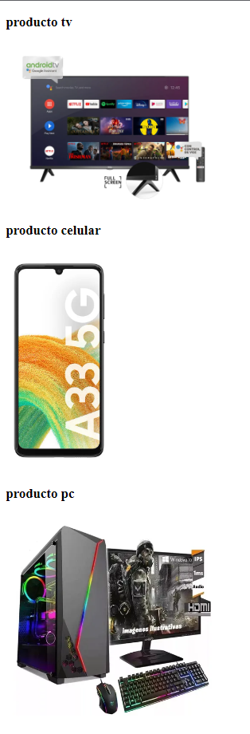
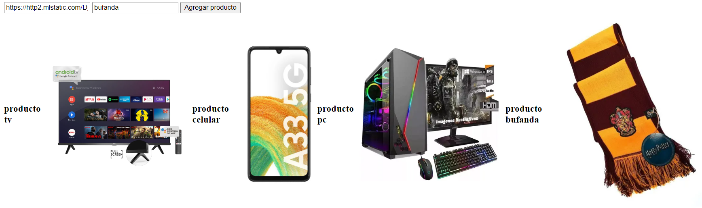

# Ejercicio array + web

1. Primer parte
    1. Usando los arrays proporcionados crear una pagina que, mediante un script, muestre los tipos de productos y sus imagenes:

        

    1. Agregar 2 productos en el script
    
    1. Repetir punto 1

1. Segunda parte
    1. Permitir que el usuario pueda agregar productos y el tipo de producto mediante la pagina:

        
    - En total tienen que mostrarse 5 productos + la cantidad que se agregue en esta ultima parte